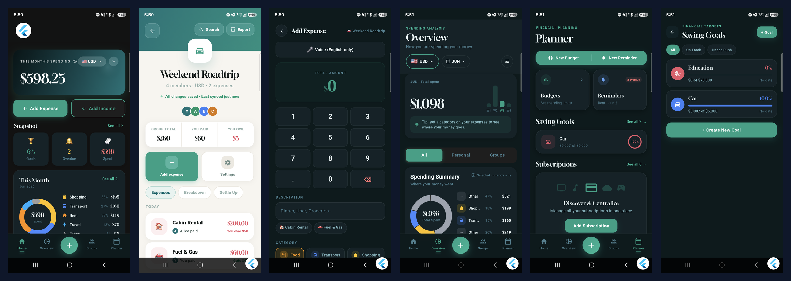
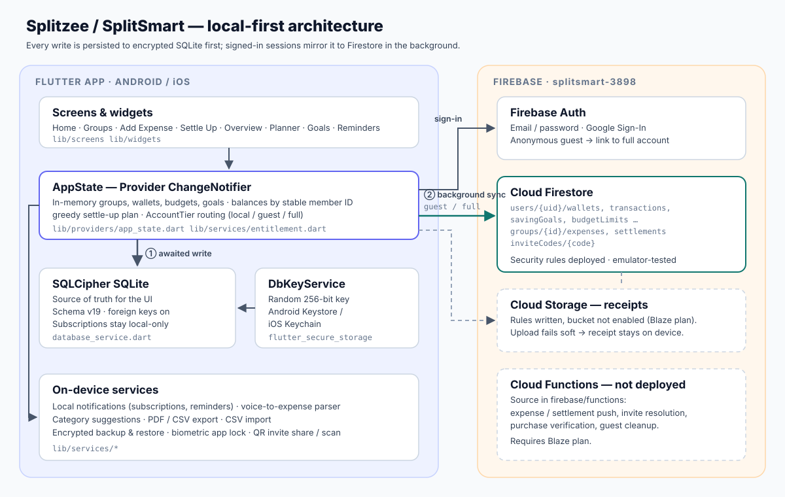
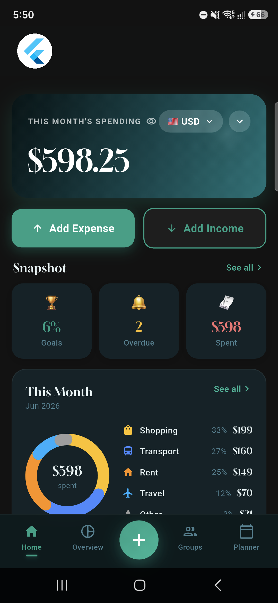
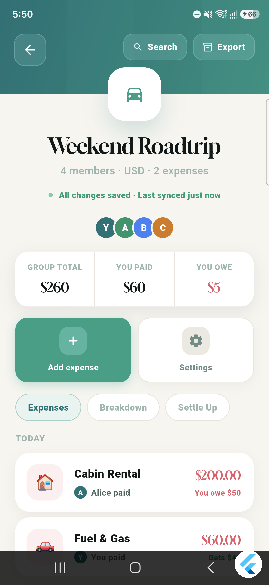
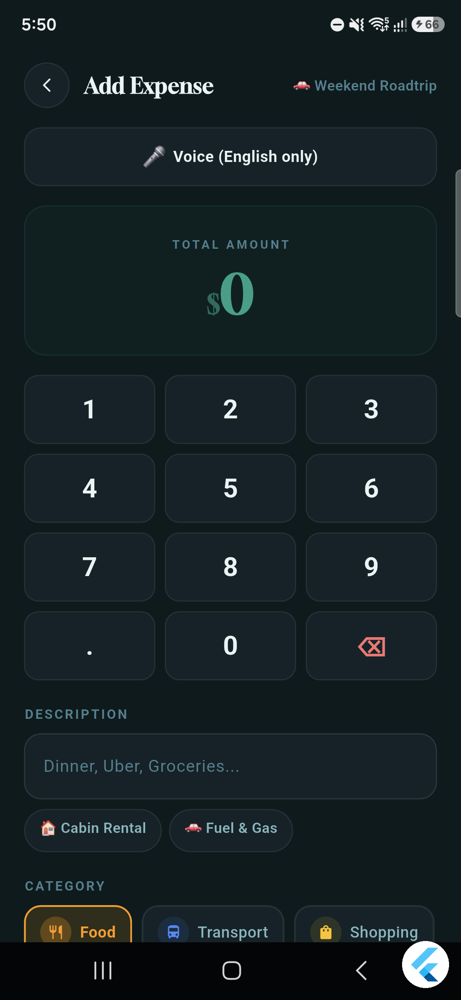
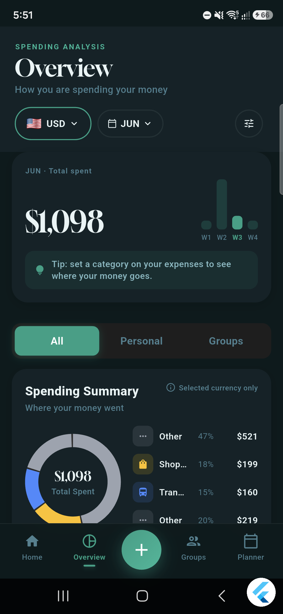
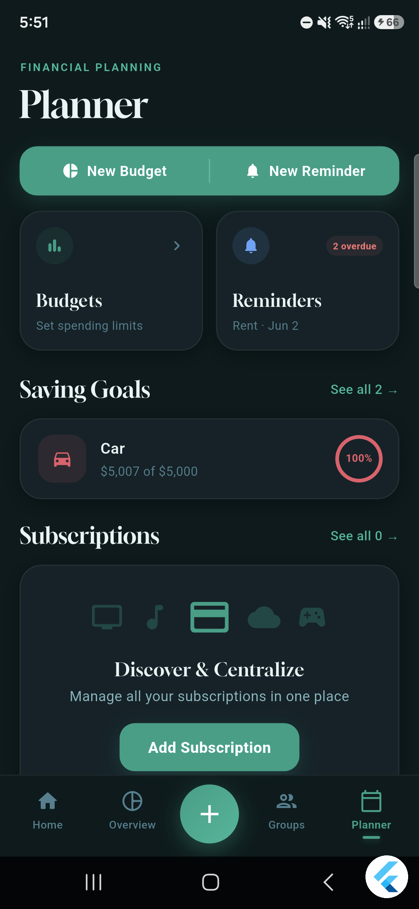
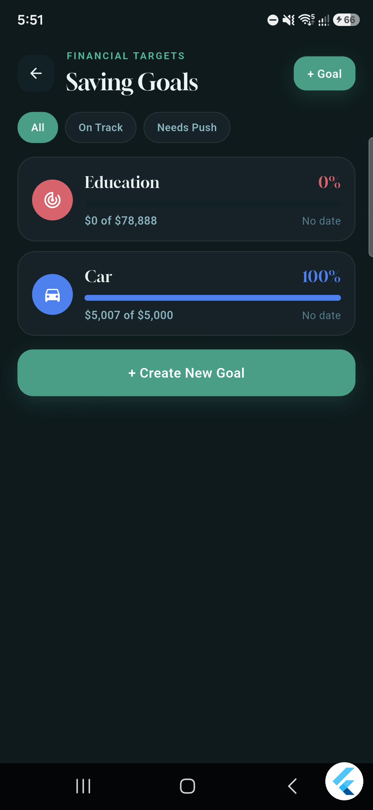

# Splitzee (SplitSmart)

A Flutter app for splitting shared expenses and managing personal money in one place — groups, balances
and settle-up alongside budgets, saving goals, subscriptions and reminders. Data is stored in an encrypted
local database first and synced to Firebase when the user signs in.

> Repository name: **SplitSmart** · App name: **Splitzee** · Android ID: `com.mighiana.splitsmart`
> **Status:** Android beta on Google Play internal testing (invite-only). Not publicly released. See [Status](#status).



---

## Problem

Shared costs (trips, flatshares, dinners) are usually tracked in one app and personal spending in another.
Group apps often need a network connection and an account for everyone, and keep a single running total that
mixes currencies. Personal-finance apps rarely know what you owe or are owed.

## Solution

One app with two halves that share the same wallets and currencies:

- **Shared:** groups with members, expenses with flexible splits, per-member balances, a minimal settle-up
  plan, QR / code invites so others can join — including as a guest without creating an account.
- **Personal:** income and expense transactions per wallet, monthly budgets per category, saving goals,
  subscriptions and reminders with local notifications.

It works fully offline without an account. Signing in adds cloud sync and sharing.

## Main features

| Area | What is implemented |
|---|---|
| Groups | Create / archive groups, members, per-group currency, QR and invite-code join, guest join via anonymous auth |
| Expenses | Equal, percentage, shares and custom-amount splits; optional receipt photo; voice entry (English) that parses amount, description and payer |
| Balances | Per-member balances keyed by stable member ID; greedy settle-up plan; recorded settlements; per-group PDF export |
| Personal finance | Multiple wallets in different currencies, income/expense transactions, CSV import, PDF reports, spending charts |
| Planning | Monthly category budgets (with subcategories), saving goals, subscriptions, reminders (local notifications) |
| Smart entry | Category suggestions from local pattern matching on past entries (no external AI service) |
| Security | SQLCipher-encrypted database, biometric app lock (`local_auth`), encrypted backup & restore |
| Platform | 8 UI languages (en, ur, ar, fr, es, de, tr, hi), dark and light themes |

## Architecture



Local-first, single-store design. Full details: **[docs/ARCHITECTURE.md](docs/ARCHITECTURE.md)**.

- **UI** — `lib/screens/` (40 screen/tab files) and `lib/widgets/`, reading state through `provider`.
- **State** — `AppState` (`lib/providers/app_state.dart`), one `ChangeNotifier` holding groups, wallets,
  budgets, goals etc., plus the balance and settle-up logic.
- **Local storage** — `DatabaseService`: SQLite via `sqflite_sqlcipher`, schema v19 with migrations.
- **Cloud** — `FirestoreService` mirrors groups, expenses, settlements and per-user data to Cloud Firestore.
- **Identity** — `AuthService` (Firebase Auth) and `entitlement.dart`, which maps a session to an `AccountTier`.

### Local / cloud data strategy

| Account tier | How | Where data lives |
|---|---|---|
| `local` | not signed in | encrypted SQLite only |
| `guest` | anonymous Firebase session (e.g. joined a group by invite) | SQLite + Firestore; personal history is **not** uploaded |
| `full` | email/password or Google | SQLite + Firestore; local data migrated on first sign-in |

Writes go to SQLite first (awaited) and to Firestore in the background (not awaited), so the UI never waits
on the network. Subscriptions (and all scheduled notifications) stay on the device; reminders, goals,
wallets and transactions sync for signed-in users.

### Authentication

Firebase Auth with email/password (with email verification and password reset), Google Sign-In, and anonymous
sign-in for guests. A guest can later link the anonymous account to Google or email without losing group
membership. Account deletion is available in-app and via a
[web request page](https://mighiana.github.io/splitsmart-privacy/delete_account.html).

### Expense → balance workflow

1. Add an expense: amount, currency, payer, split mode (Equal / % / Shares / Custom).
2. `getBalancesById` computes *paid − owed* for each member ID, then applies recorded settlements.
3. `buildSettlePlan` matches the largest creditor with the largest debtor repeatedly, giving at most *n − 1* transfers.
4. Recording a settlement saves it locally, syncs it to Firestore, and the balances recompute.

## Tech stack

| | |
|---|---|
| App | Flutter (Dart 3), `provider`, `fl_chart`, `google_fonts`, `flutter_animate` |
| Local data | `sqflite_sqlcipher`, `flutter_secure_storage`, `shared_preferences` |
| Cloud | Firebase Auth, Cloud Firestore, Cloud Storage, Cloud Messaging, Analytics, Crashlytics, App Check |
| Backend code | Firestore & Storage security rules, Cloud Functions (Node.js) source in `firebase/functions/` |
| Device | `speech_to_text`, `local_auth`, `flutter_local_notifications`, `mobile_scanner`, `qr_flutter`, `image_picker`, `pdf`, `in_app_purchase` |
| Testing | `flutter_test` (unit + widget), `@firebase/rules-unit-testing` for Firestore rules |

## Technical decisions

- **Local-first writes.** Awaiting Firestore writes while offline can stall the UI; writing to SQLite first and
  syncing in the background keeps every action instant and the app usable without a connection.
- **Encrypted local database with a device-held key.** The SQLCipher key is generated with `Random.secure()` and
  kept in Android Keystore / iOS Keychain via `flutter_secure_storage`, never in preferences or code.
- **Stable member IDs for balances.** Balances were first keyed by display name, which merges two members called
  the same thing. The balance engine now keys by member ID.
- **Guest tier via anonymous auth.** Lets someone join a shared group from an invite without signing up, while
  never uploading their personal history to a disposable anonymous UID.
- **Rules as the security boundary.** Firebase client config in the repo is public by design. Access control lives in
  `firebase/firestore.rules`: owner-only user data, membership checks on groups, join/leave updates limited to
  adding/removing the caller, and field/amount validation. The guest-join and premium rules have emulator tests.
- **Stay on the free Spark plan for now.** Cloud Functions and Storage need Blaze, so the client degrades gracefully:
  receipt upload falls back to the local file, and features that need functions are disabled or client-only.
- **Separate dev / prod flavors** with separate Firebase projects so testing never touches production data.

## Challenges / What I learned

- **Offline writes hanging.** Firestore operations awaited without connectivity could block screens. Moving to
  SQLite-first writes with fire-and-forget sync fixed it, at the cost of keeping two stores consistent.
- **Duplicate names broke balances.** A display-name-keyed map silently combined two people with the same name.
  Fixed by switching the engine to member IDs, with tests for that case (`test/widget_test.dart`).
- **Rule holes found in review.** The group join/leave path validated `memberUids` but not `members` / `memberMeta`, so a
  member could rewrite other members' names. Rules now restrict joins to append-only and leaves to remove-only.
- **Encrypting an existing database.** Moving from plaintext SQLite to SQLCipher meant handling three backup types on
  restore (legacy plaintext, device key, user passphrase) without risking live data on a wrong passphrase.
- **Cost constraints shape architecture.** Several server-side features (push triggers, purchase verification, stricter
  invite resolution) are written but undeployed because they need a paid plan; the client had to work without them.

## Status

**Complete (in the current Android beta)**
- Groups, expenses, all four split modes, balances, settle-up plan and settlements
- Wallets, personal transactions, budgets, saving goals, subscriptions, reminders, charts
- Email / Google / guest authentication, Firestore sync, deployed Firestore rules
- SQLCipher encryption, app lock, backup / restore, CSV import, PDF export, 8 languages

**Partially complete**
- **Receipts** — photos are attached and stored on device; cloud upload code exists but Cloud Storage is not enabled.
- **Push notifications** — FCM client code exists; the triggering Cloud Functions are not deployed.
- **Premium / in-app purchases** — paywall and client purchase flow exist; server-side verification is not deployed.
- **App Check** — activated in the client; console enforcement not yet confirmed.
- **Same-name members** — engine supports them; the payer picker and Breakdown tab still use display names.
- **iOS** — Flutter code is cross-platform, but no iOS Firebase config or flavors are set up; only Android is tested.

**Planned (design docs only)**
- Bank account sync — [docs/BANK_SYNC_PLAN.md](docs/BANK_SYNC_PLAN.md)
- Remaining category-hierarchy phases — [docs/CATEGORY_HIERARCHY_PLAN.md](docs/CATEGORY_HIERARCHY_PLAN.md)
- Budget redesign follow-ups — [docs/BUDGET_REDESIGN_PLAN.md](docs/BUDGET_REDESIGN_PLAN.md)

## Screenshots

Captured on an Android device; the personal-info strip on the home screen is masked. Light-mode versions are in
[`screenshots/final/`](screenshots/final).

| Home | Group detail | Add expense |
|---|---|---|
|  |  |  |
| **Overview** | **Planner** | **Saving goals** |
|  |  |  |

Not yet captured: **Settle Up** plan and **QR invite** screens (see [docs/CASE_STUDY.md](docs/CASE_STUDY.md#screenshots-to-capture)).

## Getting started

**Prerequisites:** Flutter (Dart ≥ 3.0), Java 17, Android SDK. Verified with Flutter 3.47.6.

```bash
git clone https://github.com/Mighiana/SplitSmart.git
cd SplitSmart
flutter pub get
flutter test                          # unit + widget tests
flutter run --flavor prod             # a flavor is required: prod or dev
flutter build apk --debug --flavor prod
```

- `prod` uses `android/app/google-services.json` (Firebase project `splitsmart-3898`);
  `dev` uses `android/app/src/dev/google-services.json`. To use your own Firebase project, replace these files.
- Release builds need a signing key: copy `android/app/key.properties.template` to `key.properties` and fill it in.
  The build refuses to fall back to debug signing silently.
- Firebase rules: `cd firebase && firebase deploy --only firestore:rules`. Rules tests: `cd firebase/test && npm install && npm test`
  (needs the Firebase emulator). Storage rules and Cloud Functions require the Blaze plan.

### Project layout

```
lib/
  providers/   AppState + data models
  screens/     UI screens (group_tabs/ for group detail tabs)
  services/    database, firestore, auth, backup, notifications, voice, export …
  widgets/     shared widgets
  l10n/        translations
firebase/      firestore.rules, storage.rules, functions/, rules tests
docs/          architecture, case study, design plans, Play data-safety notes
test/          unit and widget tests
```

## Tests

`flutter test` runs 73 tests covering balance calculation (including same-name members), the settle-up plan,
model serialization, budgets and categories, subscription maths, account-tier / guest rules, the voice-input
parser, and widget rendering. The guest-join / premium Firestore rules have a separate emulator suite in `firebase/test/`
(needs Java + the Firestore emulator; not part of `flutter test`).

## Security & configuration

- `google-services.json` and the web `FirebaseOptions` in `lib/main.dart` contain Firebase **client** identifiers.
  These are not secrets; access is enforced by security rules and Auth.
- Signing keys (`*.jks`, `*.keystore`, `key.properties`), `.env` files and service-account keys are git-ignored and not in the repository.
- Obfuscation maps (`debug-symbols/`) and raw, unmasked screenshots are git-ignored: the maps would undo
  `--obfuscate`, and the raw captures show real account details. Archive release symbols privately.
- Shared group docs are written by other members' clients, so the app parses them type-safely
  (`lib/services/cloud_doc_parser.dart`) and only loads remote receipt images from Firebase Storage hosts.
  Firestore rules also bound the type, size and key count of expense and settlement docs.
- Privacy policy: <https://mighiana.github.io/splitsmart-privacy/privacy_policy.html>

## Further docs

- [docs/ARCHITECTURE.md](docs/ARCHITECTURE.md) — layers, data flow, security model
- [docs/CASE_STUDY.md](docs/CASE_STUDY.md) — short portfolio summary
- [PROJECT.md](PROJECT.md) — detailed developer handoff and changelog
- [docs/CONSOLE_HARDENING.md](docs/CONSOLE_HARDENING.md), [docs/PLAY_DATA_SAFETY.md](docs/PLAY_DATA_SAFETY.md)
