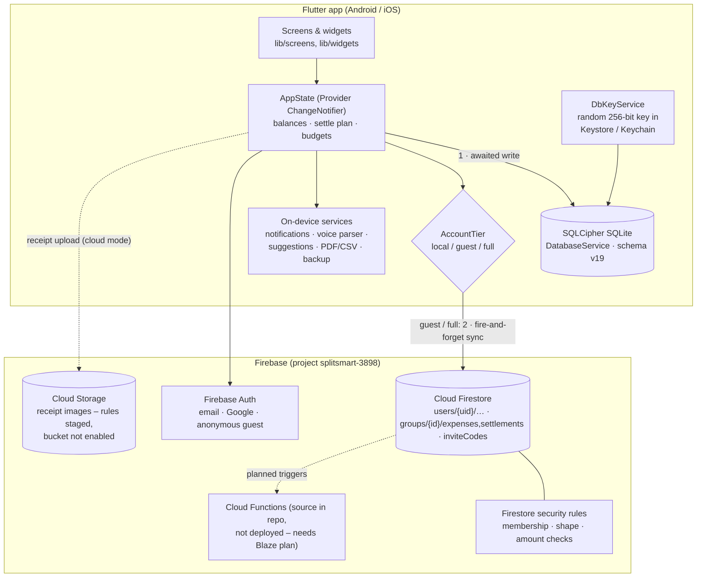

# Architecture

Splitzee (repository: SplitSmart) is a **local-first** Flutter app. Every write lands in an
encrypted on-device SQLite database first; when the user is signed in, the same change is
mirrored to Cloud Firestore in the background so groups can be shared between devices and people.

Mermaid source (renders on GitHub)

## Layers

| Layer | Where | Responsibility |
|---|---|---|
| UI | `lib/screens/`, `lib/screens/group_tabs/`, `lib/widgets/` | 40 screen/tab files; reads state via `Provider`, never talks to storage directly |
| State | `lib/providers/app_state.dart`, `app_state_models.dart` | Single `ChangeNotifier`: in-memory groups, wallets, transactions, budgets, goals, subscriptions, reminders; balance + settle-up maths; decides local vs cloud |
| Local persistence | `lib/services/database_service.dart`, `db_key_service.dart` | SQLCipher-encrypted SQLite (`sqflite_sqlcipher`), schema migrations up to v19 |
| Cloud persistence | `lib/services/firestore_service.dart`, `storage_service.dart` | Firestore mirror of groups/expenses/settlements and per-user data; receipt upload to Storage (falls back to the local file path when Storage is unavailable) |
| Identity | `lib/services/auth_service.dart`, `entitlement.dart` | Firebase Auth (email/password, Google, anonymous); maps the session to an `AccountTier` |
| Device services | `notification_service.dart`, `voice_input_service.dart`, `smart_suggestions_service.dart`, `export_service.dart`, `backup_service.dart`, `security_service.dart` | Local notifications, voice-to-expense parsing, category suggestions, PDF/CSV export, encrypted backups, biometric app lock |
| Backend | `firebase/firestore.rules`, `firebase/storage.rules`, `firebase/functions/` | Firestore rules are deployed; Storage rules and Cloud Functions are source-only (both need the Blaze plan) |

## Data strategy

**Account tiers** (`lib/services/entitlement.dart`):

| Tier | Session | Storage | Local history migrated to cloud? |
|---|---|---|---|
| `local` | not signed in | SQLite only | – |
| `guest` | Firebase anonymous auth (e.g. joining a group by invite) | SQLite + Firestore | **No** – personal history is not uploaded to a throwaway anonymous UID |
| `full` | email/password or Google | SQLite + Firestore | Yes, on first sign-in |

**Write path** (example: `AppState.addExpenseToGroup`):

1. Try to upload the receipt image (cloud mode only). `StorageService.uploadReceipt` returns `null` on any error, and the expense keeps the local image path.
2. `await DatabaseService.insertExpense(...)` – the local write is the source of truth for the UI.
3. `unawaited(FirestoreService.insertExpense(...))` – failures are logged (`[cloud] expense sync deferred`), never shown as a blocking error. Firestore's offline persistence queues the write until the device is back online.
4. Update the in-memory list and `notifyListeners()`.

Firestore's own offline cache can make awaited writes hang without a network; writing locally first
and syncing in the background keeps the app usable offline.

**What stays local only:** subscriptions and all scheduled local notifications. Reminders, saving goals, wallets,
transactions and budget limits are also mirrored under `users/{uid}/` for signed-in users.

## Balance and settle-up workflow

1. An expense stores the payer, amount, currency and per-member split. The Add Expense screen offers four split modes: **Equal**, **%**, **Shares** and **Custom** amounts.
2. `AppState.getBalancesById(group)` sums, per **stable member ID**, what each member paid minus their
   share, then applies recorded settlements. (Earlier versions keyed by display name, which broke when two
   members had the same name; `getAllBalances` remains as a name-keyed view for UI.)
3. `AppState.buildSettlePlan(group)` splits members into creditors and debtors, sorts both by amount
   and greedily matches the largest of each, producing at most *n − 1* transfers.
4. Recording a settlement writes a settlement row (local + Firestore) and the balances recompute.

Amounts in different currencies are never summed into one total; each wallet / group keeps its own currency.

Known limitation: the balance engine and storage support members with identical names, but the Add Expense payer picker and the Breakdown tab still select/group by display name.

## Security model

- **Data at rest:** the SQLCipher key is 64 hex characters from `Random.secure()`, stored with
  `flutter_secure_storage` (Android Keystore-backed EncryptedSharedPreferences, iOS Keychain). It is never
  written to SharedPreferences or source.
- **Backups:** portable backups are SQLCipher snapshots, optionally re-keyed with a user passphrase.
- **Cloud access:** Firestore rules require auth, restrict `users/{uid}` to its owner, restrict group data to
  `memberUids`, constrain join/leave updates to append/remove only the caller, and validate amount fields.
  Rules have emulator tests in `firebase/test/`.
- **Client config:** `google-services.json` and the web `FirebaseOptions` in `lib/main.dart` contain Firebase
  *client* identifiers. These are public by design; access is enforced by rules (and App Check once enforced).
  Signing keys (`*.jks`, `key.properties`) and service-account keys are git-ignored and not in the repo.
